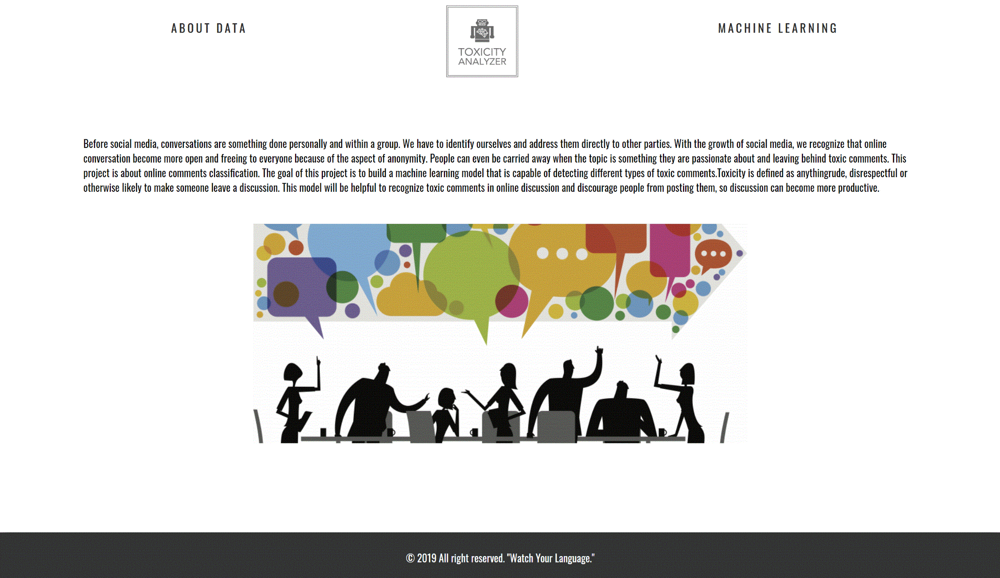

# project3_toxicityAnalyzer

## problem statement
Online conversations are very open and freeing to everyone because there is an aspect of anonymity and some people exhibit lack of empathy. Because of that reasons, some people often experience rude or disrespectful comments and left feeling unpleasant. Negative comments often result in the interruptions of discussions. We want to recognize the toxicity comments in advance and discourage people from posting them with the help of machine learning. We will be using a dataset from youtube, twitter and reddit comments labeled for identity mentions. The data contains different types of toxicity like threats, obscenity, insults, and identity-based hate. Also, we will analyze and visualize the data with various aspects and want people to be more mindful in our conversation.

## data set

* the dataset contains text that may be considered profane, vulgar, or offensive.
* train data: 1.8million x 45, test data: 97.3k x 2

https://www.kaggle.com/c/jigsaw-unintended-bias-in-toxicity-classification/data
https://dlab.berkeley.edu/landing-page/online-hate-index-scalable-detection-online-hate-speech

